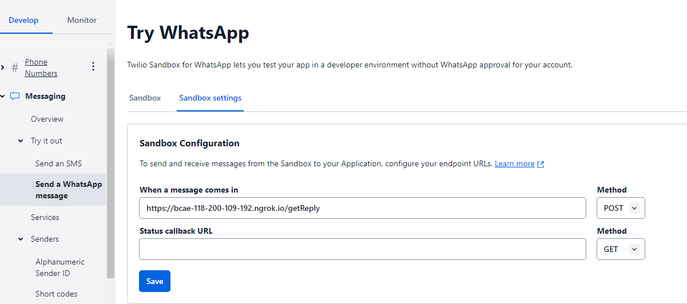

# Team-Jerry
**For Testing**
**Setup**
```
#Install dependencies
pip install -r requirements.txt
pip install firebase-admin --user
pip install flask_session --user
#Run
python main.py

```
- Next, Go to terminal, click on "PORTS" tab and forward the port to 5000.
- Once forwarded, change port visibility to public

Copy the forwarded address and change it in the twilio consile + /getReply
e.g. https://4sp0b7wl-5000.asse.devtunnels.ms/getReply


**Twilio Account:**
- Username: smufypteamjerry2@gmail.com
- Password: Gljr4231@Leefamily22

**Join the Twilio sandbox to test on own phone**
Send join shoot-forgot to the number +1 (415) 523-8886


ocbcbanking123@